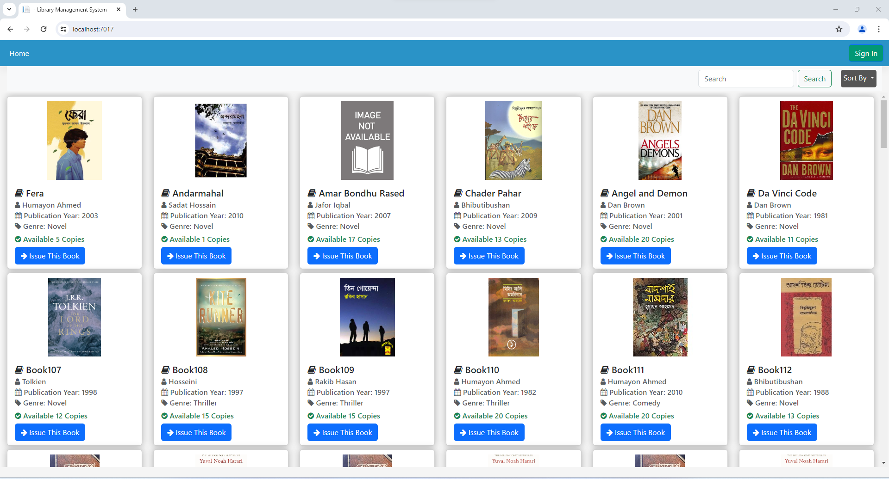
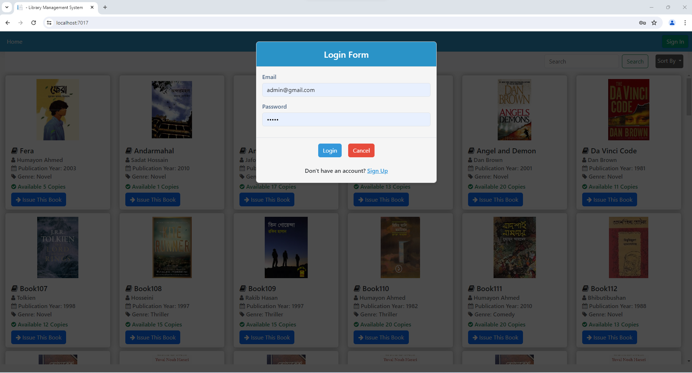
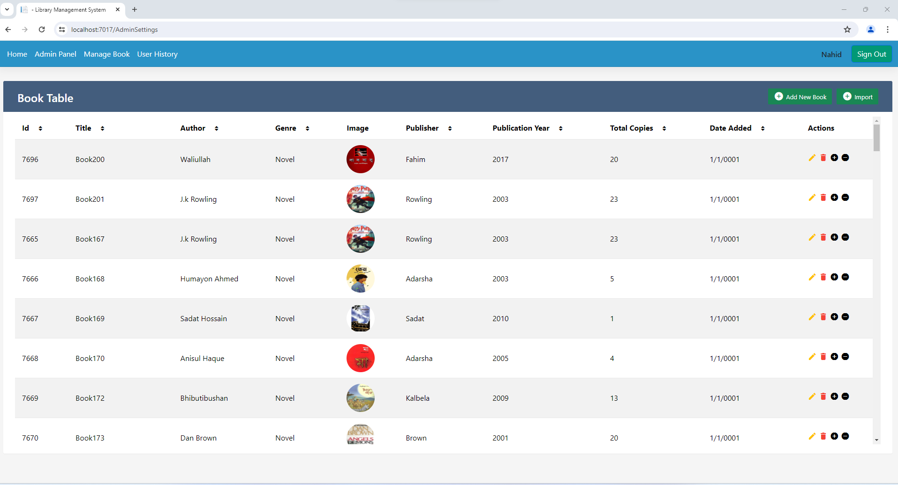

# Online Public Library

## Overview
The Online Public Library is a web application developed using ASP .NET Core 6 MVC, HTML, CSS, Bootstrap, and JavaScript. It facilitates users in borrowing and returning books, searching for books, and managing the library's collection. The application includes features such as an admin panel for managing books and user accounts, sorting and searching functionalities, and the ability to issue and return books.

## Features
- **Admin Panel**: Manage books, user accounts, and library settings.
- **Sorting**: Sort books by title, author, category, etc.
- **Searching**: Search for books by title, author, or category.
- **Issue Book**: Allow users to borrow books from the library.
- **Return Book**: Enable users to return borrowed books to the library.

## Screenshots

### Home Page

### Book Search

### Admin Panel

## Prerequisites
- [.NET Core 6 SDK](https://dotnet.microsoft.com/download/dotnet/6.0)
- [Visual Studio 2022](https://visualstudio.microsoft.com/vs/)
- [SQL Server](https://www.microsoft.com/en-us/sql-server/sql-server-downloads)
